# DDS Management Service

## Описание проекта

DDS Management Service — это веб-приложение для учета, управления и анализа движения денежных средств. Система позволяет пользователям вести детальный финансовый учет, классифицируя операции по типам, категориям и подкатегориям с соблюдением строгих логических зависимостей.

## Стек технологий

Проект построен на современных и надежных технологиях:

| Компонент           | Технология                      |
| :------------------ | :------------------------------ |
| **Язык бэкенда**    | Python 3.12.10                  |
| **Фреймворк**       | Django / Django REST Framework  |
| **База данных**     | PostgreSQL                      |
| **Фронтенд**        | HTML5, CSS3, Vanilla JavaScript |
| **Стилизация**      | Bootstrap 5                     |
| **Контейнеризация** | Docker & Docker Compose         |

## Интерфейс приложения и демонстрация работы

### 1. Управление транзакциями (Главная страница)

#### Главный экран системы ДДС

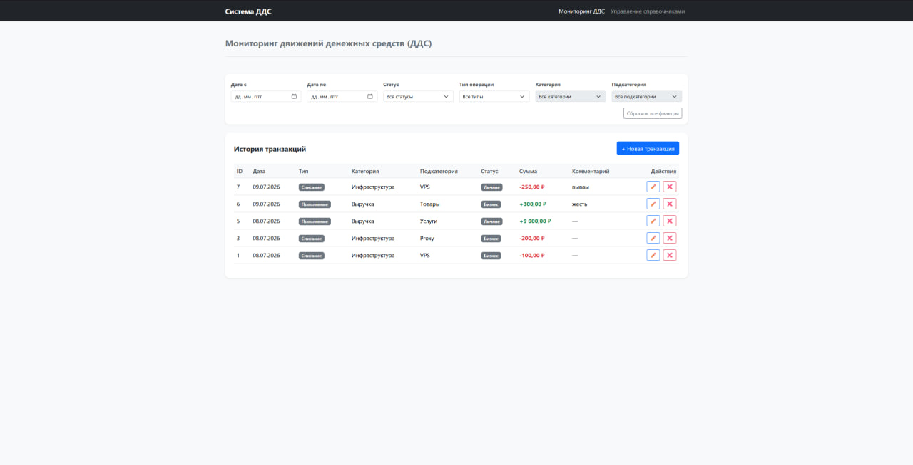
_Центральная панель управления, отображающая полную историю движений денежных средств, badges с типами операций и текущие статусы._

#### Фильтрация и поиск данных (Демонстрация различных сценариев)

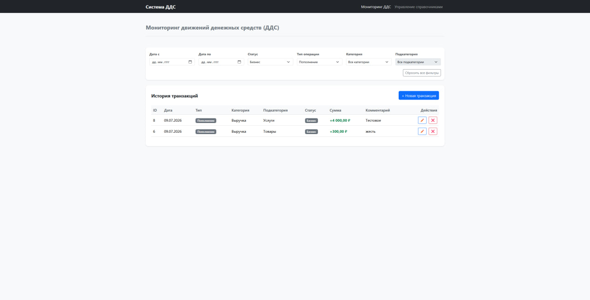
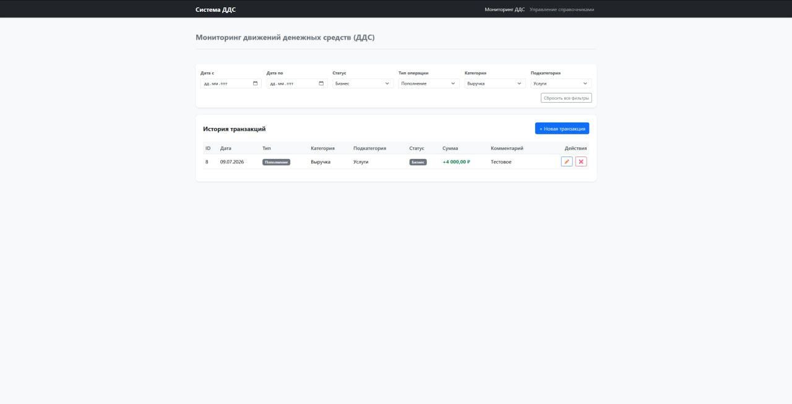
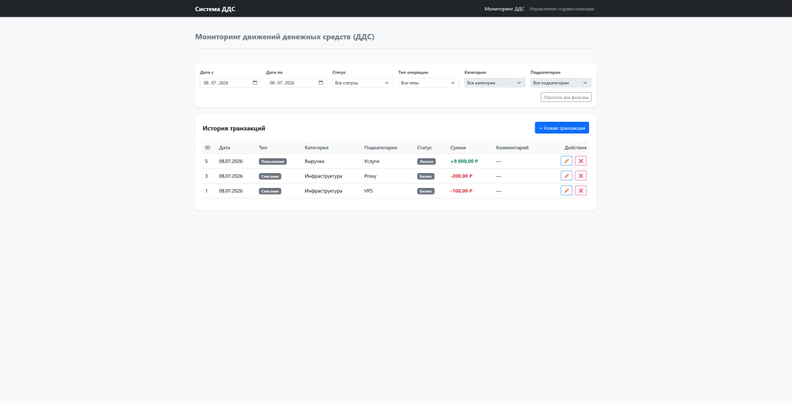
_Примеры работы динамических фильтров. Система автоматически пересчитывает и перерендеривает таблицу транзакций при фильтрации по датам, статусам, типам или связанным категориям._

#### Операции с транзакциями (Добавление, Изменение, Удаление)

- **Добавление новой записи:**  
  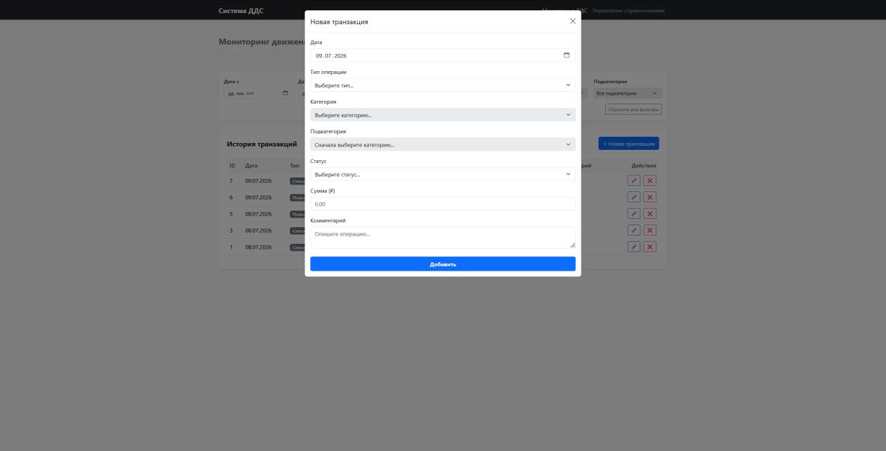  
  _Интерфейс модального окна для создания новой транзакции с заполнением основных параметров._
- **Редактирование записи:**  
  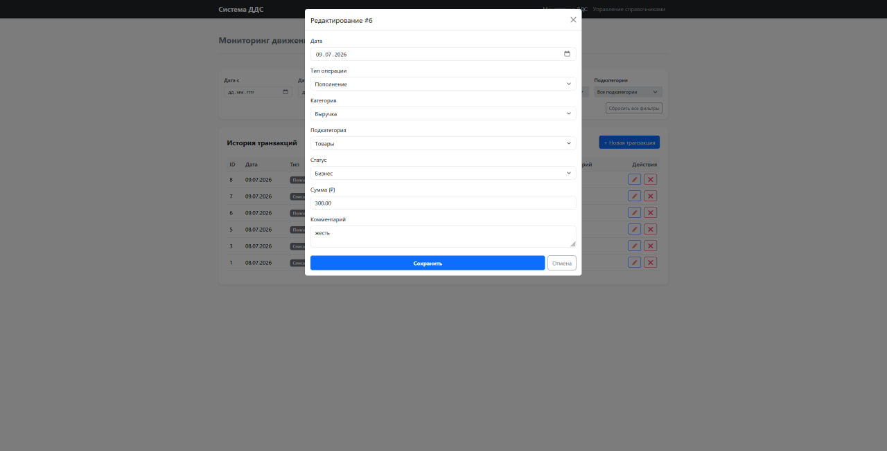  
  _Форма изменения существующей транзакции с предзаполненными данными._
- **Удаление записи:**  
  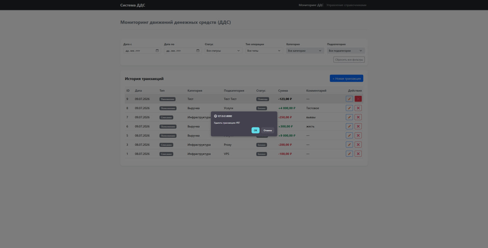  
  _Диалоговое окно подтверждения удаления транзакции из системы._

---

### 2. Управление справочниками (Категории, Подкатегории, Статусы)

#### Панель управления справочниками

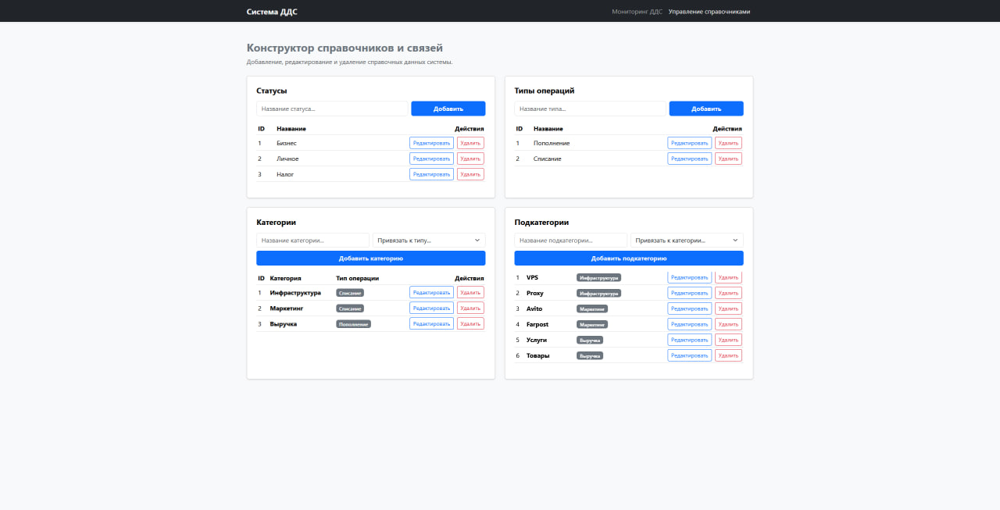
_Интерфейс для администрирования сущностей: добавление и редактирование доступных типов, категорий, подкатегорий и статусов транзакций._

#### Процесс добавления элементов в справочники

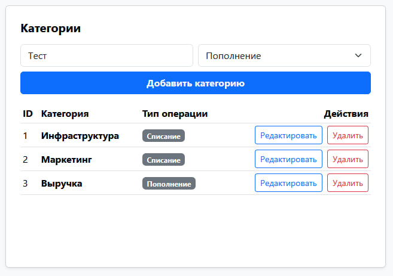

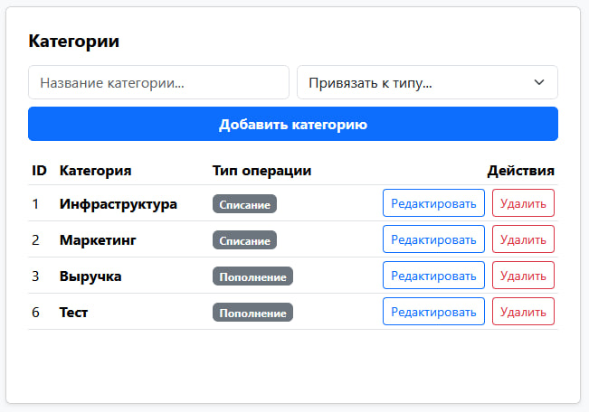
_Создание новых элементов справочника для расширения аналитики учета денежных потоков._

#### Редактирование элементов справочника

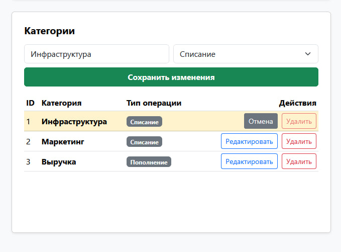
_Изменение названий или параметров существующих категорий/статусов._

#### Удаление элементов и обработка ошибок (Валидация бизнес-логики)

- **Успешное удаление:**  
  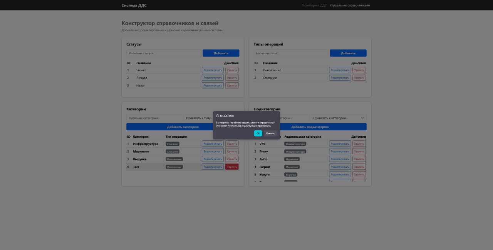  
  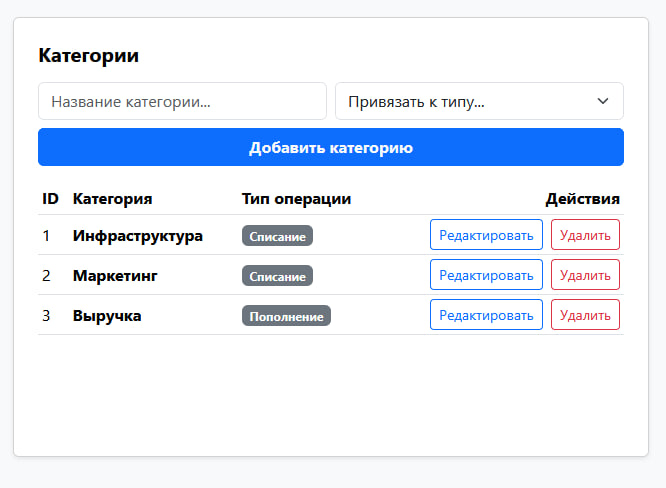  
  _Процесс очистки неиспользуемых элементов справочника._
- **Обработка ошибки удаления (Случай с каскадной зависимостью):**  
  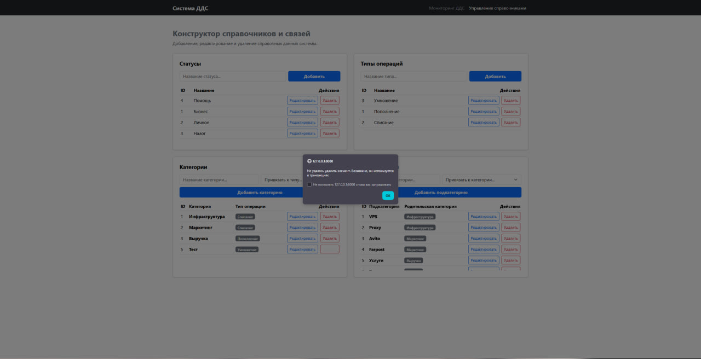  
  _Демонстрация работы защитных механизмов: система выводит понятную ошибку, если пользователь пытается удалить категорию или статус, к которым уже привязаны существующие транзакции._

## Установка

## Инструкция по запуску через Docker

### 1. Предварительные требования

Убедитесь, что у вас установлены:

- [Docker](https://docs.docker.com/get-docker/)
- [Docker Compose](https://docs.docker.com/compose/install/)

### 2. Подготовка

Клонируйте репозиторий и перейдите в папку проекта:

```bash
git clone <ссылка-на-ваш-репозиторий>
cd <название-папки-проекта>
```

### 3. Запуск проекта

Для сборки образов и запуска всех сервисов (Django + БД) выполните одну команду:

```bash
docker-compose -f docker/docker-compose.yml up --build
```

### 4. Запуск и настройка базы данных

При первом запуске проект автоматически выполнит следующие действия внутри контейнера `web`:

- **Ожидание готовности базы данных.**
- **Применение всех миграций.**
- **Загрузка начальных данных (фикстур)** из `apps/dictionaries/fixtures/initial_data.json`.
- **Запуск сервера разработки.**

Если вам нужно выполнить действия вручную (например, обновить фикстуры или создать суперпользователя), используйте следующие команды:

**Применить миграции вручную:**

```bash
docker-compose exec web python manage.py migrate
```

**Загрузить фикстуры вручную:**

```bash
docker-compose exec web python manage.py loaddata apps/dictionaries/fixtures/initial_data.json
```

**Создать суперпользователя:**

```bash
docker-compose exec web python manage.py createsuperuser
```

### 5. Доступ к сервисам

После успешного запуска все компоненты системы будут доступны по следующим адресам:

- **Пользовательский интерфейс (Frontend): http://localhost:8080**
- **API / Backend (Django): http://localhost:8001**

## Альтернативный способ запуска (без Docker)

Этот способ не рекомендуется для продуктовой среды, так как требует ручной настройки окружения и системных зависимостей (PostgreSQL).

Важное отличие от Docker-сборки: > При запуске без Docker у вас не будет автоматического веб-сервера (Nginx) для фронтенда.
Это значит, что статические файлы (index.html) придется открывать либо вручную двойным кликом через браузер, либо запускать локальный сервер (например, с помощью расширения Live Server в VS Code или команды python -m http.server 8080 внутри папки с фронтендом).

### 1. Подготовка окружения

Убедитесь, что у вас установлен Python 3.12.10 и PostgreSQL. Создайте виртуальное окружение:

```bash
python -m venv venv
# Активация (Windows)
venv\Scripts\activate
# Активация (Linux/macOS)
source venv/bin/activate
```

### 2. Установка зависимостей

Установите необходимые библиотеки:

```bash
pip install -r requirements.txt
```

### 3. Настройка базы данных

- **Создайте базу данных в PostgreSQL (назовите её dds_finance или укажите свою).**
- **Настройте переменные окружения (создайте файл .env в корне проекта или экспортируйте их в терминале):**

```bash
export DB_NAME=dds_finance
export DB_USER=your_db_user
export DB_PASSWORD=your_db_password
export DB_HOST=localhost
export DB_PORT=5432
```

### 4. Запуск приложения

Выполните миграции и запустите сервер:

```bash
# Применение миграций
python manage.py migrate

# Загрузка фикстур
python manage.py loaddata apps/dictionaries/fixtures/initial_data.json

# Запуск сервера
python manage.py runserver
```
